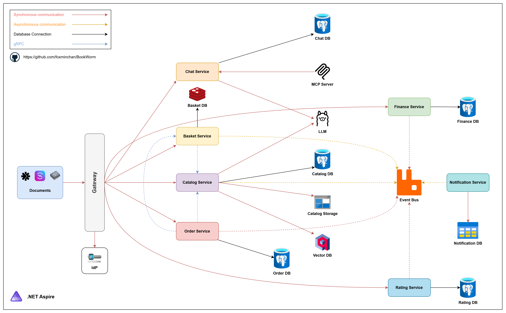

[](https://github.com/foxminchan/BookWorm/actions/workflows/ci.yaml)
[](https://sonarcloud.io/summary/new_code?id=foxminchan_BookWorm)
[](https://sonarcloud.io/summary/new_code?id=foxminchan_BookWorm)
[](https://app.netlify.com/sites/bookwormdev/deploys)

# 📖 BookWorm: A Practical .NET Aspire Application

## Introduction

<p align="justify">
⭐ BookWorm demonstrates the practical implementation of .NET Aspire in a cloud-native application. The project employs Domain-Driven Design (DDD) and Vertical Slice Architecture to organize the codebase effectively.
</p>

<div>
  <a href="https://codespaces.new/foxminchan/BookWorm?quickstart=1">
    
  </a>
</div>

## Project Goals

- [x] Developed a cloud-native application using .NET Aspire
- [x] Organized the codebase with Vertical Slice Architecture
- [x] Applied Domain-Driven Design & CQRS
- [x] Enabled service-to-service communication with gRPC
- [x] Implemented Saga patterns (Orchestration & Choreography)
- [x] Integrated Event Sourcing
- [x] Utilized Outbox and Inbox Patterns
- [x] Supported API versioning
- [x] Enabled feature flags to manage application behavior
- [x] Set up AuthN/AuthZ with Keycloak
- [x] Incorporated AI components:
  - [x] Text embedding with Nomic Embed Text
  - [x] Enabled hybrid search with Qdrant
  - [x] Integrated a chatbot using DeepSeek R1
- [x] Configured CI/CD with GitHub Actions
- [x] Created comprehensive documentation:
  - [x] Used OpenAPI for REST API documentation
  - [x] Provided AsyncAPI for event-driven endpoints
  - [x] Utilized EventCatalog for centralized architecture documentation
- [x] Established a testing strategy:
  - [x] Conducted service unit tests
  - [x] Performed load testing with k6
  - [ ] Planned integration tests

## Project Architecture



## Getting Started

### Prerequisites

- [.NET 9.0 SDK](https://dotnet.microsoft.com/download/dotnet/9.0)
- [Gitleaks](https://gitleaks.io/)
- [Docker](https://www.docker.com/get-started) or [Podman](https://podman-desktop.io/)

### System Requirements

> [!IMPORTANT]
>
> - **AI Components**: This project uses [DeepSeek R1](https://ollama.com/library/deepseek-r1) for chatbot integration and [Nomic Embed Text](https://ollama.com/library/nomic-embed-text) for text embedding, requiring an **Nvidia GPU** for local development.
> - **Email Services**: Production uses [SendGrid](https://sendgrid.com/), while local development uses [Mailpit](https://mailpit.axllent.org/) for email testing.

### Run the Application

1. Clone the repository

   ```bash
   git clone git@github.com:foxminchan/BookWorm.git
   ```

2. Change directory to the repository

   ```bash
   cd BookWorm
   ```

3. Run the application

   ```bash
   make run
   ```

> [!WARNING]
> Docker must be running on your machine before starting the application.

### Deploy the application

For detailed deployment instructions, please consult the [Deployment Guide](./deploys/README.md).

## Contributing

Please read [CONTRIBUTING.md](./.github/CONTRIBUTING.md) for details on our code of conduct, and the process for submitting pull requests to us. Thank you for contributing to BookWorm!

## Support

- If you like this project, please give it a ⭐ star.
- If you have any issues or feature requests, please [create an issue](https://github.com/foxminchan/BookWorm/issues/new/choose).

## License

This project is licensed under the MIT License - see the [LICENSE](LICENSE) file for details.
