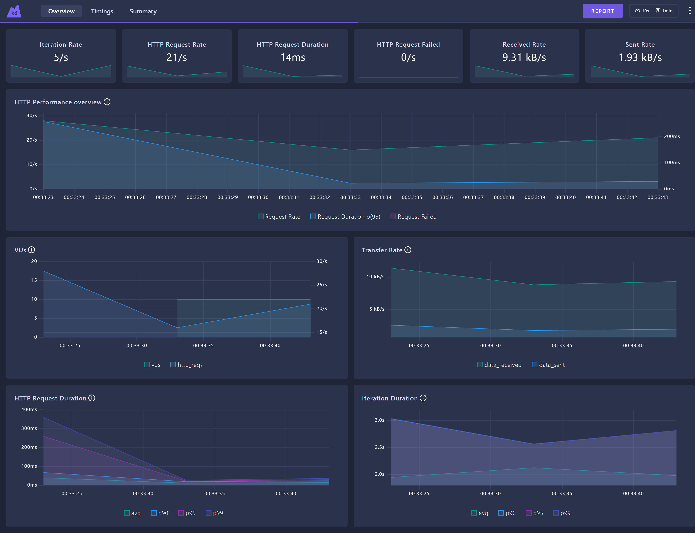
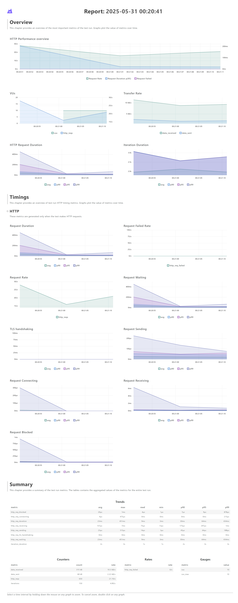

# BookWorm K6 Performance Testing Suite

This directory contains a **modern TypeScript-based** K6 performance testing suite for the BookWorm
application, migrated from a single JavaScript file to a well-structured, maintainable project.

## 🏗️ Project Structure

```
k6/
├── src/
│   ├── main.ts                 # Main entry point
│   ├── types/
│   │   ├── external-libs.d.ts  # Type declarations for external libraries
│   │   └── index.ts            # TypeScript interface definitions
│   ├── utils/
│   │   ├── seeded-random.ts   # Secure pseudorandom number generator
│   │   ├── test-data.ts       # Test data generators
│   │   ├── validation.ts      # Response validation utilities
│   │   └── helpers.ts         # Helper functions
│   ├── scenarios/
│   │   ├── browse-catalog.ts    # Browse catalog scenario
│   │   ├── search-filter.ts     # Search & filter scenario
│   │   ├── api-comprehensive.ts # Comprehensive API testing
│   │   ├── stress-test.ts       # Stress testing scenario
│   │   └── spike-test.ts        # Spike testing scenario
│   └── config/
│       └── index.ts           # K6 options and constants
├── dist/
│   ├── main.js                  # Compiled output (generated)
│   ├── main.js.map              # Source map (generated)
│   ├── summary.json             # Custom summary statistics (generated)
│   ├── summary.html             # HTML report (generated)
│   └── dashboard-report.html    # Dashboard report (generated)
├── package.json              # Dependencies and scripts
├── tsconfig.json             # TypeScript configuration
├── .prettierrc.json          # Prettier configuration
├── .prettierignore           # Files to ignore for Prettier
├── webpack.config.js         # Webpack bundling configuration
└── README.md                 # This file
```

## 📊 Test Scenarios

### 1. Browse Catalog (`browse_catalog`)

- **Purpose**: Simulates users browsing the bookstore catalog
- **Load**: Light load (3-5 VUs for development)
- **Duration**: 2 minutes
- **Behavior**: Book listings, categories, authors, pagination

### 2. Search & Filter (`search_filter`)

- **Purpose**: Tests search functionality and filtering capabilities
- **Load**: Medium load (5-8 VUs for development)
- **Duration**: 2 minutes
- **Behavior**: Search queries, price filters, sorting, pagination

### 3. API Comprehensive (`api_comprehensive`)

- **Purpose**: Systematic testing of all API endpoints
- **Load**: Medium load (3-6 VUs for development)
- **Duration**: 1.5 minutes
- **Behavior**: All endpoints, parameter combinations, edge cases, error handling

### 4. Stress Test (`stress_test`)

- **Purpose**: High-intensity testing with concurrent requests
- **Load**: High load (10-15 VUs for development)
- **Duration**: 2 minutes
- **Behavior**: Concurrent requests, complex searches, higher thresholds

### 5. Spike Test (`spike_test`)

- **Purpose**: Tests system resilience during sudden traffic spikes
- **Load**: Sudden spike (2 → 12 → 2 VUs)
- **Duration**: 1.5 minutes
- **Behavior**: Rapid traffic changes, consecutive requests, recovery testing

## Dashboard Integration

The K6 tests can be integrated with the K6 Dashboard for real-time monitoring and analysis. The
dashboard provides a visual representation of test metrics, allowing you to track performance over
time and identify bottlenecks.



## 📈 Reporting

After running tests, you'll get:

- **summary.html**: Detailed HTML report with charts and graphs
- **dashboard-report.html**: Interactive dashboard report
- **summary.json**: Machine-readable JSON output for further analysis
- **Console output**: Real-time metrics and summary statistics

The tests generate comprehensive reports showing performance metrics, response times, and validation
results. Below is an example of the HTML summary report:

<details>
<summary><em>K6 Reporter</em></summary>


</details>

<details>
<summary><em>K6 Dashboard Reporter</em></summary>



</details>

## 🛠️ Development

### TypeScript Configuration

The project uses strict TypeScript settings with:

- Path mapping for clean imports
- ESNext target for modern features
- Strict type checking
- Source maps for debugging

### Code Organization

- **Types**: Centralized interface definitions for all data structures
- **Utils**: Reusable utilities for data generation, validation, and helpers
- **Scenarios**: Modular test scenarios for different load patterns
- **Config**: Centralized configuration for K6 options and constants

### Build Process

The project uses Webpack to bundle TypeScript into a single K6-compatible JavaScript file:

1. **TypeScript compilation**: Converts TS to JS with type checking
2. **Webpack bundling**: Creates a single main.js file with all dependencies
3. **Source maps**: Enables debugging of original TypeScript code
4. **External libraries**: Handles K6-specific external imports
